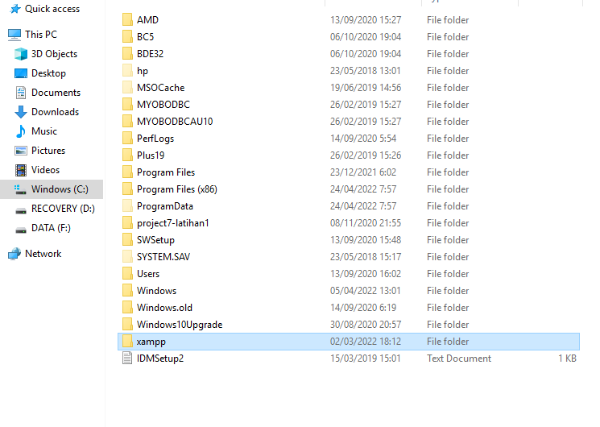
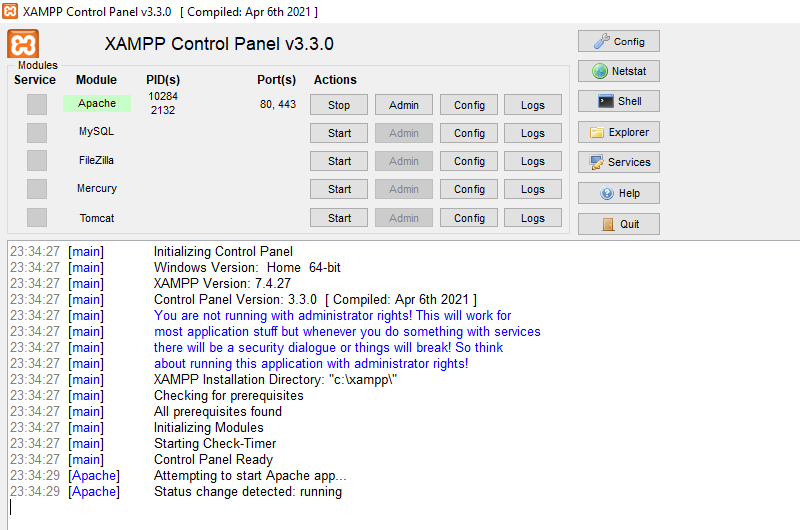

## Nama: Nahrul Wijaya
## Nim: 312010415
## Kelas: TI.20.A1

## Langkah-Langkah Praktikum 7

# 1. Install XAMPP

unduh XAMPP dari https://www.apachefriends.org/download.html

# 2. Menjalankan Web Server 

untuk menjalankan Web Server dari menu XAMPP control

< uji coba apakah server sudah bekerja 
dengan baik http://127.0.0.1 atau http://localhost

Tampilkan halaman utama XAMPP jika 
server sudah bekerja dengan baik.

< Dokumen Website Semua file website 
tempatkan di direktori: \xampp\htdocs\

< Database MYSQL Direktori:
\xampp\mysql\

Manajemen database:
https://localhost/phpmyadmin

# 3. Memulai PHP

